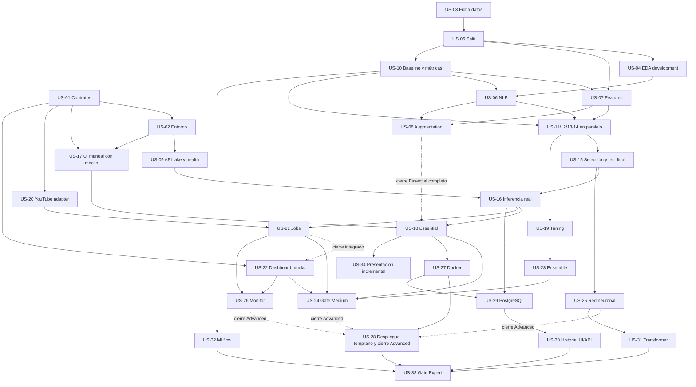

# Épicas, backlog, slices y roadmap

Estado: propuesta, sin Issues creadas ni personas asignadas. Prioridad vive en campo Project Priority (P0/P1/P2); orden es recomendación, no cadena serial. Cada US enlaza spec y pruebas.

## Épicas

### EP-01 — Entorno y entrega reproducible

Objetivo y valor: Reducir fricción y poder explicar/desplegar el producto sin acoplar servicios.

Niveles: 🟢 Essential, 🟠 Advanced. Historias: [US-01](stories/US-01.md), [US-02](stories/US-02.md), [US-27](stories/US-27.md), [US-28](stories/US-28.md), [US-34](stories/US-34.md). Seguimiento por campo Epic; la épica está Done solo cuando las historias comprometidas del nivel objetivo tienen evidencia; el resto se mantiene pendiente.

### EP-02 — Datos y NLP sin leakage

Objetivo y valor: Demostrar datos trazables y efectos medidos de NLP clásico.

Niveles: 🟢 Essential. Historias: [US-03](stories/US-03.md), [US-04](stories/US-04.md), [US-05](stories/US-05.md), [US-06](stories/US-06.md), [US-07](stories/US-07.md), [US-08](stories/US-08.md). Seguimiento por campo Epic; la épica está Done solo cuando las historias comprometidas del nivel objetivo tienen evidencia; el resto se mantiene pendiente.

### EP-03 — Evidencia y evolución del modelo

Objetivo y valor: Aprender individualmente y seleccionar por calidad, error y coste.

Niveles: 🟢 Essential, 🟡 Medium, 🟠 Advanced, 🔴 Expert. Historias: [US-10](stories/US-10.md), [US-11](stories/US-11.md), [US-12](stories/US-12.md), [US-13](stories/US-13.md), [US-14](stories/US-14.md), [US-15](stories/US-15.md), [US-19](stories/US-19.md), [US-23](stories/US-23.md), [US-25](stories/US-25.md), [US-31](stories/US-31.md). Seguimiento por campo Epic; la épica está Done solo cuando las historias comprometidas del nivel objetivo tienen evidencia; el resto se mantiene pendiente.

### EP-04 — Moderación manual asistida

Objetivo y valor: Entregar el primer recorrido de producto usable con modelo real.

Niveles: 🟢 Essential. Historias: [US-09](stories/US-09.md), [US-16](stories/US-16.md), [US-17](stories/US-17.md), [US-18](stories/US-18.md). Seguimiento por campo Epic; la épica está Done solo cuando las historias comprometidas del nivel objetivo tienen evidencia; el resto se mantiene pendiente.

### EP-05 — Moderación por vídeo

Objetivo y valor: Ampliar volumen y seguimiento con límites y errores comprensibles.

Niveles: 🟡 Medium, 🟠 Advanced. Historias: [US-20](stories/US-20.md), [US-21](stories/US-21.md), [US-22](stories/US-22.md), [US-26](stories/US-26.md). Seguimiento por campo Epic; la épica está Done solo cuando las historias comprometidas del nivel objetivo tienen evidencia; el resto se mantiene pendiente.

### EP-06 — Historial protegido

Objetivo y valor: Recuperar predicciones sin bloquear la inferencia por la DB.

Niveles: 🔴 Expert. Historias: [US-29](stories/US-29.md), [US-30](stories/US-30.md). Seguimiento por campo Epic; la épica está Done solo cuando las historias comprometidas del nivel objetivo tienen evidencia; el resto se mantiene pendiente.

### EP-07 — Calidad y operación medible

Objetivo y valor: Verificar niveles, accesibilidad, degradación y tracking opcional.

Niveles: 🟡 Medium, 🔴 Expert. Historias: [US-24](stories/US-24.md), [US-32](stories/US-32.md), [US-33](stories/US-33.md). Seguimiento por campo Epic; la épica está Done solo cuando las historias comprometidas del nivel objetivo tienen evidencia; el resto se mantiene pendiente.

## Backlog priorizado

| Orden orientativo | Historia | Nivel | Epic | Size | Priority | Inicio después de | Gate de cierre adicional |
|---|---|---|---|---|---|---|---|
| 1 | [US-01 Acordar contratos y fixtures de los slices](stories/US-01.md) | essential | EP-01 | M | P0 | — | Aprobar propuesta binaria para mocks; ML real espera OQ-02 |
| 2 | [US-02 Preparar entorno reproducible y CI mínima](stories/US-02.md) | essential | EP-01 | M | P0 | US-01 | OQ-09 |
| 3 | [US-03 Registrar dataset y semántica de etiquetas](stories/US-03.md) | essential | EP-02 | S | P0 | — | OQ-01/02 se resuelven aquí |
| 4 | [US-05 Congelar particiones y protocolo comparable](stories/US-05.md) | essential | EP-02 | M | P0 | US-03 | OQ-01/02 cerradas; tamaños condicionan split |
| 5 | [US-04 Documentar EDA de development](stories/US-04.md) | essential | EP-02 | M | P0 | US-05 | OQ-04 |
| 6 | [US-07 Comparar BoW, TF-IDF y n-gramas](stories/US-07.md) | essential | EP-02 | M | P0 | US-05, US-10 | Dataset y protocolo aprobados |
| 7 | [US-10 Establecer baseline y evaluador común](stories/US-10.md) | essential | EP-03 | M | P0 | US-05 | OQ-03 se cierra antes de entrenar candidatos |
| 8 | [US-06 Comparar limpieza y normalización textual](stories/US-06.md) | essential | EP-02 | M | P0 | US-04, US-10 | Idioma aprobado en OQ-01 |
| 9 | [US-09 Entregar conectividad y API manual con predictor fake](stories/US-09.md) | essential | EP-04 | M | P0 | US-01, US-02 | Contrato US-01 aprobado |
| 10 | [US-17 Construir interacción manual accesible con mocks](stories/US-17.md) | essential | EP-04 | M | P0 | US-01, US-02 | Contrato de mocks aprobado |
| 11 | [US-11 Evaluar individualmente Multinomial Naive Bayes](stories/US-11.md) | essential | EP-03 | M | P0 | US-06, US-07, US-10 | OQ-05: aprobar candidato y asignación; OQ-03 cerrada |
| 12 | [US-12 Evaluar individualmente Logistic Regression](stories/US-12.md) | essential | EP-03 | M | P0 | US-06, US-07, US-10 | OQ-05: aprobar candidato y asignación; OQ-03 cerrada |
| 13 | [US-13 Evaluar individualmente LinearSVC](stories/US-13.md) | essential | EP-03 | M | P0 | US-06, US-07, US-10 | OQ-05: aprobar candidato y asignación; OQ-03 cerrada |
| 14 | [US-14 Evaluar individualmente cuarto clásico por confirmar](stories/US-14.md) | essential | EP-03 | M | P0 | US-06, US-07, US-10 | OQ-05: aprobar candidato y asignación; OQ-03 cerrada |
| 15 | [US-15 Seleccionar y evaluar candidato congelado](stories/US-15.md) | essential | EP-03 | M | P0 | US-11, US-12, US-13, US-14 | OQ-03 cerrada; promoción queda bloqueada si gate falla |
| 16 | [US-16 Empaquetar e integrar inferencia real](stories/US-16.md) | essential | EP-04 | M | P0 | US-09, US-15 | US-15 gate aprobado |
| 17 | [US-08 Evaluar augmentation textual segura](stories/US-08.md) | essential | EP-02 | M | P1 | US-06, US-07 | Obligatoria para cierre Essential; ablation development independiente de US-15/16 |
| 18 | [US-18 Demostrar el producto Essential integrado](stories/US-18.md) | essential | EP-04 | S | P0 | US-16, US-17 | US-15 aprobado, contrato integrado y evidencia US-08 para cierre |
| 19 | [US-34 Preparar presentación del nivel alcanzado](stories/US-34.md) | essential | EP-01 | S | P1 | US-18 | Ninguna adicional |
| 20 | [US-19 Optimizar modelos con presupuesto acotado](stories/US-19.md) | medium | EP-03 | M | P1 | US-10, US-11, US-12, US-13, US-14 | Ninguna adicional |
| 21 | [US-20 Obtener comentarios desde URLs admitidas](stories/US-20.md) | medium | EP-05 | M | P1 | US-01, US-02 | OQ-08 antes de verificación live |
| 22 | [US-21 Procesar jobs de vídeo y consultar resultados](stories/US-21.md) | medium | EP-05 | M | P1 | US-16, US-20 | Ninguna adicional |
| 23 | [US-22 Entregar dashboard de vídeo integrado](stories/US-22.md) | medium | EP-05 | M | P1 | US-01, US-02 | Puede empezar con US-01/02; cerrar requiere US-21 |
| 24 | [US-23 Comparar ensemble con clásico](stories/US-23.md) | medium | EP-03 | M | P1 | US-19 | Ninguna adicional |
| 25 | [US-24 Ampliar pruebas de regresión y validar nivel Medium](stories/US-24.md) | medium | EP-07 | S | P1 | US-18, US-21, US-22, US-23 | Ninguna adicional |
| 26 | [US-25 Comparar LSTM o RNN apropiada](stories/US-25.md) | advanced | EP-03 | M | P1 | US-15 | OQ-06 |
| 27 | [US-26 Seguir y detener análisis periódico de vídeo](stories/US-26.md) | advanced | EP-05 | M | P1 | US-21, US-22 | Ninguna adicional |
| 28 | [US-27 Empaquetar servicios y PostgreSQL con Docker](stories/US-27.md) | advanced | EP-01 | M | P1 | US-18 | Ninguna adicional |
| 29 | [US-28 Publicar demo Advanced y validar operación](stories/US-28.md) | advanced | EP-01 | M | P1 | US-27 (incluye US-18) | OQ-07 y proveedor aprobados; cierre Advanced exige US-24/25/26/27 aceptadas |
| 30 | [US-29 Preparar repositorio PostgreSQL y migraciones](stories/US-29.md) | expert | EP-06 | M | P1 | US-16, US-27 | Política OQ-07 antes de guardar datos reales |
| 31 | [US-30 Guardar y consultar una predicción protegida](stories/US-30.md) | expert | EP-06 | M | P1 | US-17, US-29 | OQ-07 cerrada |
| 32 | [US-31 Evaluar transformer detrás del predictor común](stories/US-31.md) | expert | EP-03 | M | P1 | US-16, US-25 | OQ-06 |
| 33 | [US-32 Registrar experimentos con MLflow opcional](stories/US-32.md) | expert | EP-07 | M | P1 | US-10 | Ninguna adicional |
| 34 | [US-33 Demostrar Expert y degradación acumulada](stories/US-33.md) | expert | EP-07 | M | P1 | US-28, US-30, US-31, US-32 | Ninguna adicional |

## Dependency map

Aristas sólidas: dependencia de inicio o promoción real. US-22 puede comenzar con contrato; la arista punteada desde US-21 bloquea solo su aceptación integrada. OQ se cierran antes de sus historias indicadas en discovery. No hay dependencia Essential → nivel superior.

El diagrama resume el grafo; la tabla y cada historia enumeran todos los prerequisitos. US-08 no bloquea US-15/16 ni el inicio de US-18: su arista punteada exige evidencia únicamente para declarar Essential completo. Puede realizarse como ablation posterior sobre development, sin alterar el candidato congelado ni reutilizar test; una promoción posterior requiere nuevo ciclo con holdout independiente. MLflow y DB pueden desarrollarse en paralelo una vez disponibles sus puertos, pero nunca son blockers de Essential. US-34 presenta el nivel logrado, no espera Expert.

## Vertical slices

US-28 puede comenzar tras US-27 y su producto integrado US-18, sin esperar US-24/25/26. El orden de la tabla no obliga a esperar todas las capacidades Advanced: se permite probar antes un despliegue Essential/Medium y registrar el nivel realmente validado. Las aristas punteadas de US-24/25/26 son gates de cierre de US-28 y de declaración Advanced, junto con US-27 y los AC de publicación; la validación técnica temprana no los sustituye.

| Slice | Valor | Componentes | Contrato | Dependencias reales | Nivel / historias |
|---|---|---|---|---|---|
| A Conectividad | Saber si la herramienta puede analizar | UI + health API + readiness modelo | GET health/live y ready | contratos y entorno; fake solo desarrollo | Essential US-09 |
| B Comentario manual | Señal revisable sobre un texto | UI + API + servicio + ML + NullRepo + E2E | POST predictions + Predictor | UI con mocks desde US-01/02; cierre modelo aprobado | Essential US-09/16/17/18 |
| C Vídeo | Revisar lote con cobertura explícita | UI + job API + YouTube + batch ML + memoria + E2E | video-analyses y results | parser/adapter/modelo para cierre; dashboard inicia con mocks | Medium US-20/21/22 |
| D Seguimiento | Revisar nuevos comentarios de forma acotada | UI + monitor API + scheduler + jobs + tests | video-monitors | Slice C integrado | Advanced US-26 |
| E Historial | Recuperar resultado autorizado | UI + API + servicio + SQL repo + DB + E2E | predictions GET + persistence | puerto/modelo; DB solo para esta ampliación | Expert US-29/30 |
| F Tracking | Comparar runs y recuperar evidencia | training + tracker local + MLflow + tests | tracker local Python | evaluador/manifests, no frontend | Expert US-32 |

F es slice de experimentación, no se fuerza un frontend artificial. Las tareas de datos son habilitadoras necesarias; el resto del backlog entrega recorridos de producto.

## Paralelización del equipo

Naimireth y María pueden repartirse formulario/estados y cliente/mocks/accesibilidad de US-17 después de contratos/entorno, sin esperar US-15. Veru y Víctor pueden abordar API/health y adapter de inferencia/pruebas con fake. Cada historia mantiene una persona responsable de integrar y review cruzado; no se inventa asignación definitiva.

Durante la fase ML, los cuatro entrenan individualmente US-11–14 tras aprobar candidato/persona, compartiendo evaluator y folds. Esto consume capacidad de los mismos cuatro: paralelización técnica no significa ocho personas disponibles. EDA responsable pendiente. Recomendación WIP de cuatro historias activas total, máximo una por persona y dos en Review; priorizar desbloquear contratos y reviews. Ninguna fecha o duración de sprint se inventa.

## Roadmap sin fechas

| Fase | Objetivo / resultado demostrable | Trabajo paralelo | Exit criteria |
|---|---|---|---|
| 0 Foundation | Revisar plan, contratos y entorno | revisión equipo; ficha dataset | US-01/02 aprobadas, gates identificados; sin afirmar producto |
| 1 Data & contracts | Particiones y baseline reproducibles | US-03/05/04/06/07/10; UI y API fake en paralelo | dataset/ontología/protocolo/métricas cerrados; mocks compatibles |
| 2 Primer recorrido | UI/API determinista de desarrollo | US-09 y US-17 | flujo con fake visible; no declarar nivel Essential todavía |
| 3 ML clásico y Essential | cuatro modelos y primer clásico integrado; augmentation obligatoria como ablation development independiente | cuatro experimentos individuales; US-15/16 sin esperar US-08; ablation paralela o posterior a integración | US-15 gate aprobado y US-18 E2E real; US-08 completada para declarar Essential completo; US-34 puede presentar |
| 4 Medium | vídeo integrado, tuning y ensemble | US-19/23 vs US-20/21/22 | US-24; Essential sigue funcionando solo |
| 5 Advanced | red neuronal comparada, monitor y demo Docker pública | US-25/26 en paralelo al despliegue US-28 desde US-27; se permite validar antes una versión Essential/Medium integrada | US-28 cerrada con US-24/25/26/27 aceptadas y AC de publicación; OQ de publicación cerrada; sin Expert requerido |
| 6 Expert | transformer, historial y tracking | US-29/30, US-31, US-32 independientes | US-33 y evidencia de degradación |
| 7 Presentación y cierre | explicar nivel realmente conseguido | informes, demo y revisión cruzada de evidencias acumuladas | US-34 actualizada; sin gates fallidos reclamados como éxito |

Calidad/accesibilidad/seguridad y hardening se verifican en cada fase, no se posponen a fase 7. Cada nivel puede detenerse con producto ejecutable si su gate pasa. Modelos de niveles superiores pueden evaluarse en development sin sustituir el candidato productivo; cualquier nueva promoción respeta protocolo de holdout independiente.
